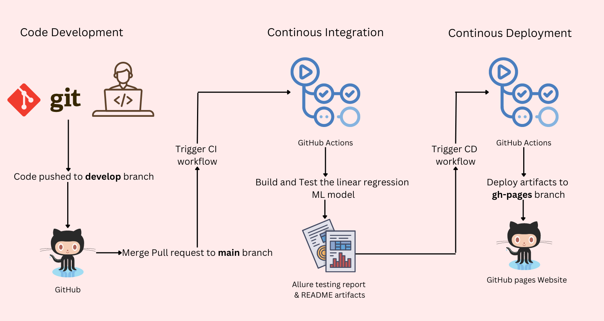

# RL Open Source Fest Screening Exercise 2023

## General Description

This repository contains pytests for a new training algorithm for regression with the `NewTrainer` abstract interface and Its implementation `LinearRegression` class on completing the screening exercise of "Testing infrastructure for VowpalWabbit" RLOSF 2023 Project.

Submitted by: Mohamed Awnallah <mohamedmohey2352@gmail.com> <br>

# Description of the Screening exercise
Let’s say we have just implemented a new training algorithm for regression with the following interface:

```python
class NewTrainer:
    ...
    def train(self, x: List[List[float]], y: List[float]):
        ...

    def predict(self, x: List[float]) -> float:
        ...
        return 0
```
```
Design and write test suite for it in Python using unittest or pytest frameworks.
```
## Requirements
First clone the project using this command:
```bash
git clone https://github.com/mhmdawnallah/RLOSF-Screening-Exercise-Testing-Infrastructure-for-VowalWabbit.git
cd RLOSF-Screening-Exercise-Testing-Infrastructure-for-VowalWabbit
```
Then install the following the following dependencies using this command:
```bash
pip install -r requirements.txt
```

## Running Tests
To run the tests, use the following command from the root directory:
```bash
export PYTHONPATH=$PYTHONPATH:$PWD/src
pytest -v
```

## CI/CD Workflow
Although CI/CD (Continous Integration/Continous Deployment) workflow is not required in the screening exercise in `Testing Infrastructure for VowalWabbit`, I'd like to take it a step further and integrate the testing of the linear regression machine learning with GitHub actions. Additionally, GitHub pages will be used to display [Allure](https://github.com/allure-framework) testing report and README documentation.

The latest updated testing report could be found [here](https://mhmdawnallah.github.io/RLOSF-Screening-Exercise-Testing-Infrastructure-for-VowalWabbit/allure_testing_report/#)

Here is the CI/CD Workflow diagram:


## Project Hierachy
```
project/
│
├── github/workflows/
│   └── ci_cd.yml # Continous Integration and Deployment Workflow using GitHub Actions
│
├── src/
│   ├── linear_regression.py # Linear Regression Class which is the implementation of NewTrainer Abstract Interface
│   └── new_trainer.py # NewTrainer Abstract Interface for regression algorithms implementation
│
├── tests/
│   └── test_linear_regression.py # Test suit for Linear Regression
├── requirements.txt
├── README.md
└── .gitignore
```